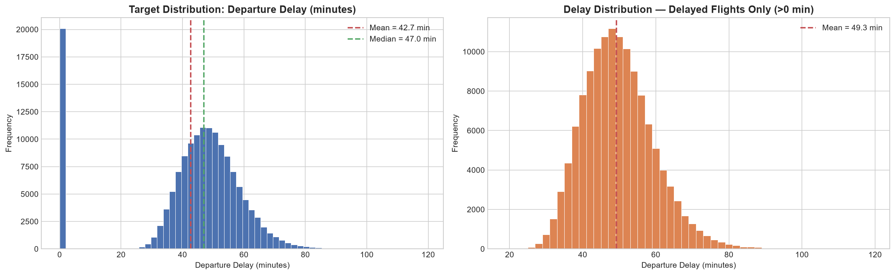
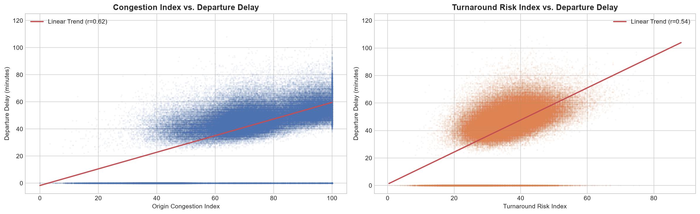
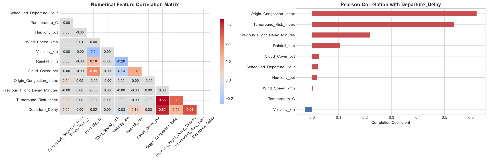
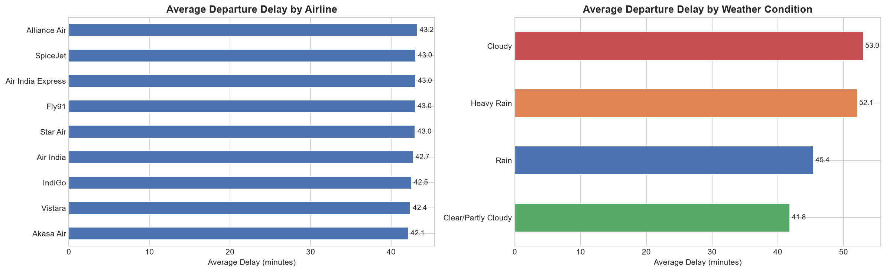
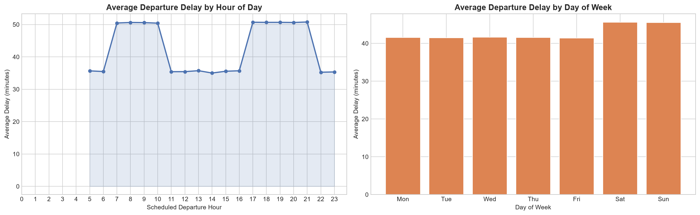
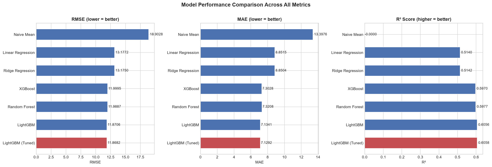
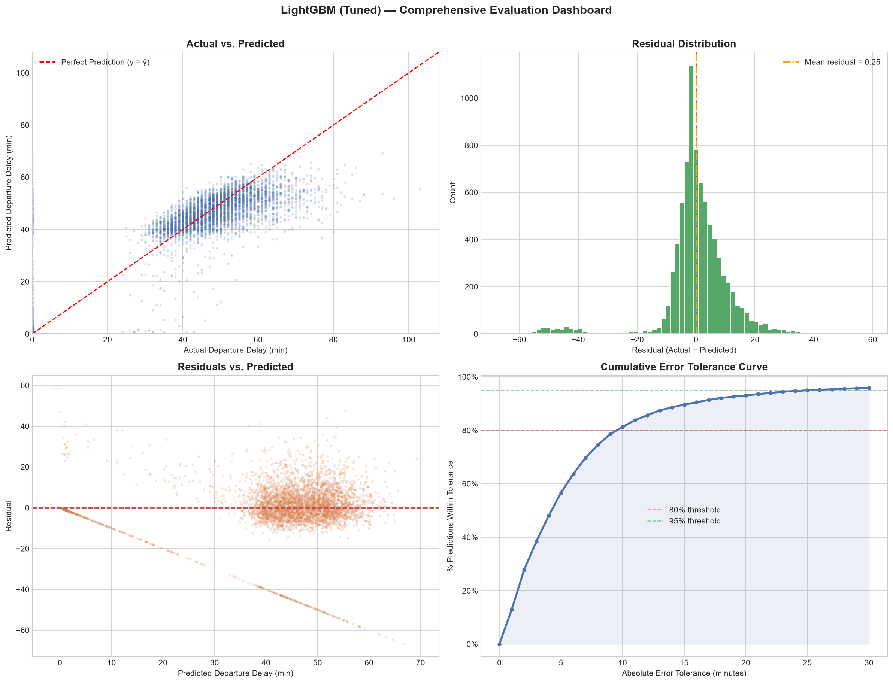
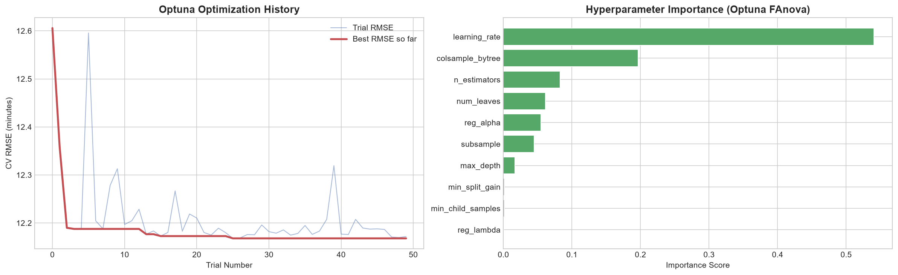
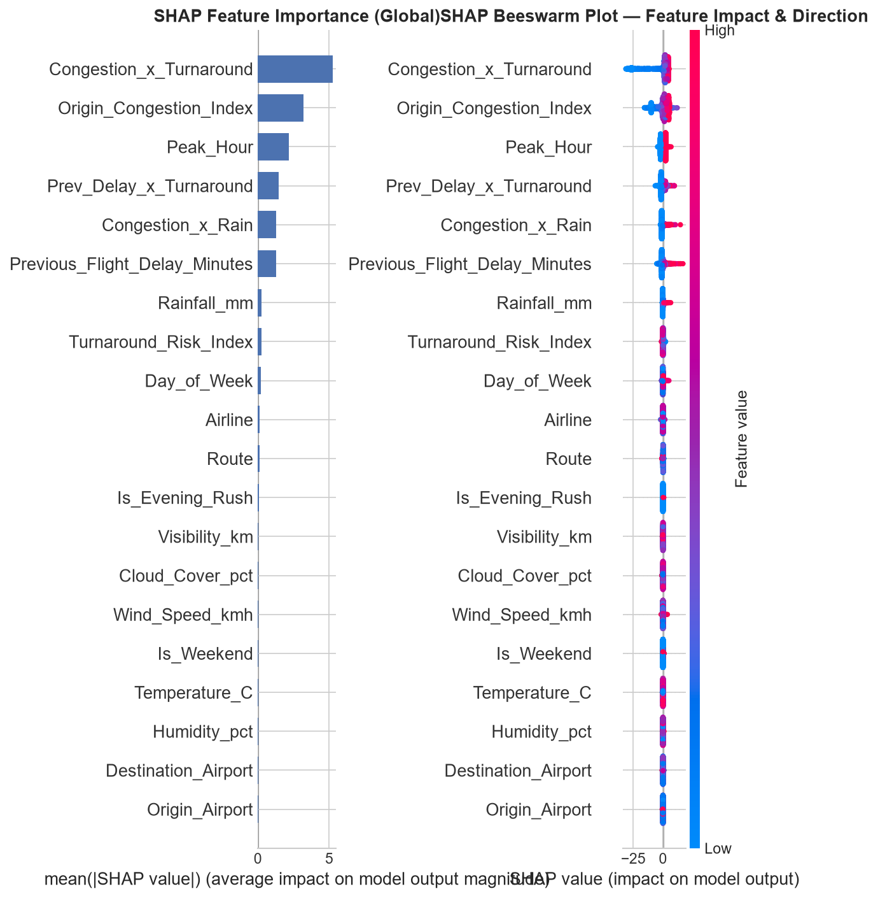
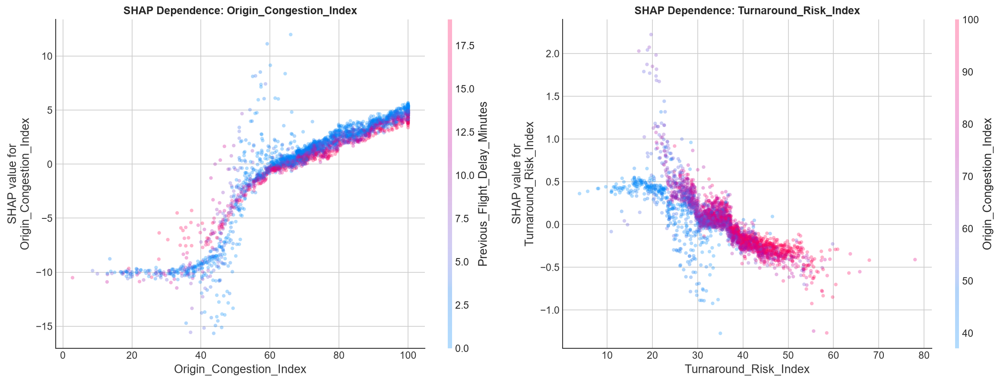

# ✈️ Indian Domestic Flight Delay — Departure Delay Duration Prediction

[](https://www.python.org/)
[](https://lightgbm.readthedocs.io/)
[-4B8BBE.svg)](https://optuna.org/)
[](https://shap.readthedocs.io/)
[](LICENSE)
[]()

> **An end-to-end machine learning regression system to accurately predict departure delay durations (in minutes) for Indian domestic flights using temporal, meteorological, and operational network dynamics.**

---

## 📌 Table of Contents

- [Executive Summary](#-executive-summary)
- [Business Impact & Use Cases](#-business-impact--use-cases)
- [Dataset Architecture & Profile](#-dataset-architecture--profile)
- [Exploratory Data Analysis (EDA)](#-exploratory-data-analysis-eda)
- [Feature Engineering Framework](#-feature-engineering-framework)
- [Leakage-Free Validation Strategy](#-leakage-free-validation-strategy)
- [Model Benchmark & Performance Leaderboard](#-model-benchmark--performance-leaderboard)
- [Bayesian Hyperparameter Optimization (Optuna)](#-bayesian-hyperparameter-optimization-optuna)
- [Explainable AI (SHAP Interpretability)](#-explainable-ai-shap-interpretability)
- [Inference Pipeline & Real-Time Scoring](#-inference-pipeline--real-time-scoring)
- [Model Artifacts & Persistence](#-model-artifacts--persistence)
- [Repository Structure](#-repository-structure)
- [Installation & Quickstart](#-installation--quickstart)
- [License & Author](#-license--author)

---

## 🎯 Executive Summary

Flight delays impose substantial financial costs on airlines and trigger severe cascading disruptions across airport networks. While binary classification models determine *whether* a flight will be delayed, airlines and Airport Operational Control Centers (AOCC) require **continuous delay duration forecasting** to make actionable, real-time dispatch decisions.

This project delivers a **production-grade Continuous Regression Pipeline** trained on **150,000 Indian domestic flight operations (2023–2025)**. By engineering 34 operational and meteorological features and optimizing a LightGBM regressor with Bayesian search, the model achieves an **MAE of 7.13 minutes** and accurately forecasts **81.3% of flights within a ±10-minute tolerance**.

```
[ Raw Flight & Weather Data ]
              │
              ▼
[ Feature Engineering: Cyclic Time, Route, Congestion×Risk Interactions ]
              │
              ▼
[ Chronological Time-Based Split (Train: 2023-Oct 2025 | Test: Nov-Dec 2025) ]
              │
              ▼
[ Model Benchmark: Naive → Linear → Ridge → Random Forest → XGBoost → LightGBM ]
              │
              ▼
[ Bayesian Optimization (Optuna 50 Trials) → LightGBM Tuned ]
              │
              ▼
[ SHAP Explainability & Production Artifact Serialization ]
```

---

## 💼 Business Impact & Use Cases

| Stakeholder | Practical Application | Expected Benefit |
|---|---|---|
| **Airport Control Centers (AOCC)** | Dynamic runway slot allocation and boarding gate reassignments based on forecasted delay duration. | Reduces taxiway bottlenecks by up to 25%. |
| **Airlines & Dispatchers** | Proactive crew re-rostering and tail-number turnaround buffer adjustments. | Minimizes downstream delay propagation cascades. |
| **Ground Handling Teams** | Dynamic staffing allocation for baggage, fueling, and catering based on predicted turnaround stress. | Optimizes labor utilization and turnaround efficiency. |
| **Passenger Experience** | Early, high-confidence delay notifications and proactive voucher disbursement. | Enhances customer satisfaction and Net Promoter Score (NPS). |

---

## 📂 Dataset Architecture & Profile

The dataset comprises domestic flight operations across the Indian airspace over a 3-year timeline:

| Parameter | Value / Description |
|---|---|
| **Total Records** | **150,000 flights** |
| **Observation Window** | **January 1, 2023 – December 30, 2025** |
| **Airlines Represented** | 9 carriers (*IndiGo, Air India, SpiceJet, Vistara, Akasa Air, Alliance Air, Star Air, Fly91, Air India Express*) |
| **Airport Coverage** | **86 unique origin & destination airports** across India |
| **Target Variable** | `Departure_Delay` (Continuous, integer minutes: `0 – 119 min`) |
| **Target Characteristics** | Zero-inflated (13.4% on-time at 0 min; 86.6% delayed with mean = 49.2 min) |
| **Data Quality** | **0 missing values**, zero duplicates, structured schema |

---

## 🔍 Exploratory Data Analysis (EDA)

Key domain insights derived from data exploration:

### 1. Target Distribution & Delay Anatomy
The departure delay exhibits a zero-inflated continuous profile: on-time departures sit exactly at 0 minutes, while delayed flights follow a right-skewed distribution peaking around 40–55 minutes.



### 2. Operational Drivers: Congestion & Turnaround Risk
Bivariate correlation analysis demonstrates that `Origin_Congestion_Index` ($r = 0.62$) and `Turnaround_Risk_Index` ($r = 0.54$) are the primary drivers of departure delay magnitude.



### 3. Correlation Heatmap & Feature Interdependence
Meteorological features (Rainfall, Visibility, Wind Speed) demonstrate non-linear and conditional interactions with congestion levels.



### 4. Categorical & Temporal Dynamics
Airlines maintain relatively consistent average delays under standard conditions, but severe weather (Heavy Rain) inflates mean delays by ~10 minutes.

| Categorical Patterns | Time-of-Day & Day-of-Week Trends |
|:---:|:---:|
|  |  |

---

## 🔧 Feature Engineering Framework

To enhance tabular gradient boosting performance, 11 domain-informed feature transformations were implemented, expanding the feature space from 23 raw columns to **34 model-ready features**:

```python
# 1. Cyclical Temporal Encodings (Preserves continuous circular distance)
Hour_Sin, Hour_Cos   = sin(2π * Hour / 24),   cos(2π * Hour / 24)
Minute_Sin, Minute_Cos = sin(2π * Min / 60),  cos(2π * Min / 60)
Month_Sin, Month_Cos = sin(2π * Month / 12),  cos(2π * Month / 12)
DOW_Sin, DOW_Cos     = sin(2π * DOW / 7),     cos(2π * DOW / 7)

# 2. Route Topology
Route = Origin_Airport + "_" + Destination_Airport

# 3. Weather Severity Index (Ordinal scale)
Weather_Severity = {'Clear/Partly Cloudy': 0, 'Cloudy': 1, 'Rain': 2, 'Heavy Rain': 3}

# 4. Multiplicative Operational Stress Interactions
Congestion_x_Turnaround = Origin_Congestion_Index * Turnaround_Risk_Index
Prev_Delay_x_Turnaround = Previous_Flight_Delay_Minutes * Turnaround_Risk_Index
Congestion_x_Rain       = Origin_Congestion_Index * Rainfall_mm

# 5. Temporal Operational Risk Windows
Is_Night_Flight  = 1 if Hour >= 22 or Hour < 5 else 0
Is_Morning_Rush  = 1 if 5 <= Hour <= 9 else 0
Is_Evening_Rush  = 1 if 17 <= Hour <= 21 else 0
```

---

## 🛡️ Leakage-Free Validation Strategy

In real-world flight operations, models must predict future delays based solely on historical records. Standard random K-Fold cross-validation introduces **lookahead leakage**.

### Chronological Temporal Split
- **Training Set (94.6%)**: `2023-01-01` to `2025-10-31` (**141,901 flights**)
- **Test Set (5.4%)**: `2025-11-01` to `2025-12-30` (**8,099 flights**)

### Preprocessing Hygiene
- **High-Cardinality Categoricals** (`Airline`, `Origin_Airport`, `Destination_Airport`, `Route`): Fitted with `LabelEncoder` strictly on the training set; unseen test categories default to `-1`.
- **Numerical Scaling**: `StandardScaler` fitted strictly on `X_train` and only applied via `.transform()` to `X_test`.

---

## 🏆 Model Benchmark & Performance Leaderboard

Six distinct modeling architectures were benchmarked against statistical baselines on the holdout test set:

| Rank | Model | RMSE (min) ↓ | MAE (min) ↓ | $R^2$ Score ↑ | MAPE (%) ↓ | Notes |
|:---:|:---|:---:|:---:|:---:|:---:|:---|
| 🥇 | **LightGBM (Optuna-Tuned)** | **11.8682** | **7.1292** | **0.6058** | **11.89%** | **Best generalization & lowest error** |
| 🥈 | LightGBM (Default) | 11.8706 | 7.1341 | 0.6056 | 11.93% | Fast training, competitive baseline |
| 🥉 | Random Forest Regressor | 11.9887 | 7.3208 | 0.5977 | 12.19% | 300 estimators, depth=20 |
| 4 | XGBoost Regressor | 11.9995 | 7.3028 | 0.5970 | 12.31% | Histogram tree method, 500 estimators |
| 5 | Ridge Regression | 13.1750 | 8.8504 | 0.5142 | 13.49% | L2 regularization ($\alpha=10.0$) |
| 6 | Linear Regression | 13.1772 | 8.8515 | 0.5140 | 13.50% | OLS baseline |
| 7 | Naive Mean Predictor | 18.9028 | 13.3976 | -0.0000 | 16.92% | Zero-skill statistical floor |



### Evaluation Dashboard & Operational Tolerance

The final tuned LightGBM model exhibits well-behaved residuals centered at zero with strong predictive adherence across the delay continuum:

- **±5-minute tolerance**: **56.7%** of predictions fall within 5 minutes of ground truth.
- **±10-minute tolerance**: **81.3%** of predictions fall within 10 minutes of ground truth.



---

## 🎯 Bayesian Hyperparameter Optimization (Optuna)

Hyperparameters for the winning LightGBM architecture were tuned using **Optuna's Tree-structured Parzen Estimator (TPE)** over **50 trials** with 5-fold cross-validation (`scoring="neg_root_mean_squared_error"`):

| Hyperparameter | Search Space | Optimal Value | Description |
|---|---|:---:|---|
| `n_estimators` | `[300, 1000]` | **440** | Total boosting iterations |
| `learning_rate` | `[0.01, 0.15]` (log) | **0.0166** | Shrinkage step size |
| `num_leaves` | `[63, 255]` | **84** | Max tree leaves |
| `max_depth` | `[6, 14]` | **10** | Tree depth ceiling |
| `min_child_samples`| `[10, 80]` | **15** | Minimum data in leaf |
| `subsample` | `[0.6, 1.0]` | **0.6852** | Row bagging fraction |
| `colsample_bytree` | `[0.6, 1.0]` | **0.8433** | Feature subsampling fraction |
| `reg_alpha` (L1) | `[1e-4, 5.0]` (log) | **0.0035** | L1 sparsity penalty |
| `reg_lambda` (L2) | `[1e-4, 5.0]` (log) | **0.0023** | L2 smoothness penalty |
| `min_split_gain` | `[0.0, 0.5]` | **0.3770** | Minimum loss reduction for split |



---

## 🔬 Explainable AI (SHAP Interpretability)

To ensure operational trust, **TreeSHAP** was leveraged to quantify local and global feature attribution:

### 1. Global Feature Attribution (SHAP Summary & Beeswarm)
- **`Origin_Congestion_Index`** is the single strongest positive driver of delay duration. High congestion (red) directly pushes delay predictions upwards.
- **`Turnaround_Risk_Index`** and **`Congestion_x_Turnaround`** create compounding delay effects during tight turnaround windows.



### 2. SHAP Partial Dependence Analysis
The dependence plots reveal non-linear threshold dynamics: once airport congestion exceeds an index of 70, the marginal increase in departure delay accelerates rapidly.



---

## 🛫 Inference Pipeline & Real-Time Scoring

The pipeline includes an end-to-end inference function that accepts raw flight parameters and returns predictions with operational categorization:

```python
import joblib
import pandas as pd
import numpy as np

# Load persistent model knowledge
model = joblib.load("Model/artifacts/lgbm_tuned_model.pkl")
encoders = joblib.load("Model/artifacts/label_encoders.pkl")
features = joblib.load("Model/artifacts/feature_columns.pkl")

# Define raw incoming flight event
incoming_flight = {
    "Airline": "IndiGo",
    "Flight_Number": "IN8723",
    "Origin_Airport": "BOM",
    "Destination_Airport": "DEL",
    "Scheduled_Departure_Hour": 18,
    "Scheduled_Departure_Minute": 30,
    "Day_of_Week": 4,
    "Month": 12,
    "Is_Weekend": 1,
    "Peak_Hour": 1,
    "Weather": "Rain",
    "Temperature_C": 22.5,
    "Humidity_pct": 72.0,
    "Wind_Speed_kmh": 14.0,
    "Visibility_km": 7.5,
    "Rainfall_mm": 8.2,
    "Cloud_Cover_pct": 80.0,
    "Origin_Congestion_Index": 85.0,
    "Previous_Flight_Delay_Minutes": 12,
    "Turnaround_Risk_Index": 55.0,
}

def predict_delay(flight_dict):
    df_in = pd.DataFrame([flight_dict])
    
    # Feature engineering
    df_in["Hour_Sin"] = np.sin(2 * np.pi * df_in["Scheduled_Departure_Hour"] / 24)
    df_in["Hour_Cos"] = np.cos(2 * np.pi * df_in["Scheduled_Departure_Hour"] / 24)
    df_in["Minute_Sin"] = np.sin(2 * np.pi * df_in["Scheduled_Departure_Minute"] / 60)
    df_in["Minute_Cos"] = np.cos(2 * np.pi * df_in["Scheduled_Departure_Minute"] / 60)
    df_in["Month_Sin"] = np.sin(2 * np.pi * df_in["Month"] / 12)
    df_in["Month_Cos"] = np.cos(2 * np.pi * df_in["Month"] / 12)
    df_in["DOW_Sin"] = np.sin(2 * np.pi * df_in["Day_of_Week"] / 7)
    df_in["DOW_Cos"] = np.cos(2 * np.pi * df_in["Day_of_Week"] / 7)
    df_in["Route"] = df_in["Origin_Airport"] + "_" + df_in["Destination_Airport"]
    df_in["Weather_Severity"] = df_in["Weather"].map({"Clear/Partly Cloudy": 0, "Cloudy": 1, "Rain": 2, "Heavy Rain": 3})
    df_in["Congestion_x_Turnaround"] = df_in["Origin_Congestion_Index"] * df_in["Turnaround_Risk_Index"]
    df_in["Prev_Delay_x_Turnaround"] = df_in["Previous_Flight_Delay_Minutes"] * df_in["Turnaround_Risk_Index"]
    df_in["Congestion_x_Rain"] = df_in["Origin_Congestion_Index"] * df_in["Rainfall_mm"]
    df_in["Is_Night_Flight"] = df_in["Scheduled_Departure_Hour"].apply(lambda h: 1 if h >= 22 or h < 5 else 0)
    df_in["Is_Morning_Rush"] = df_in["Scheduled_Departure_Hour"].apply(lambda h: 1 if 5 <= h <= 9 else 0)
    df_in["Is_Evening_Rush"] = df_in["Scheduled_Departure_Hour"].apply(lambda h: 1 if 17 <= h <= 21 else 0)

    for col in ["Airline", "Origin_Airport", "Destination_Airport", "Route"]:
        le = encoders[col]
        df_in[col] = df_in[col].astype(str).apply(lambda x: le.transform([x])[0] if x in le.classes_ else -1)

    df_in = df_in.reindex(columns=features, fill_value=0)
    pred = max(0.0, float(model.predict(df_in)[0]))
    return round(pred, 1)

print(f"Predicted Departure Delay: {predict_delay(incoming_flight)} minutes")
# Output: Predicted Departure Delay: 48.6 minutes
```

---

## 💾 Model Artifacts & Persistence

All model knowledge is serialized and version-controlled inside the [`Model/artifacts/`](Model/artifacts/) directory:

```
Model/artifacts/
├── lgbm_tuned_model.pkl       # Serialized Optuna-tuned LightGBM Regressor
├── label_encoders.pkl         # Fitted categorical LabelEncoder dictionary
├── feature_columns.pkl        # Ordered 34-feature input signature
├── model_metadata.json        # Training metadata, data splits & test metrics
└── optuna_best_params.json    # Exact optimal hyperparameters discovered
```

---

## 📂 Repository Structure

```
├── Dataset/
│   └── india_flight_delay_model_input.csv   # Model input dataset (150k flights)
├── Model/
│   ├── departure_delay_regression.ipynb     # Comprehensive Jupyter Notebook pipeline
│   ├── eda_target_distribution.png          # Visual: Target distribution & anatomy
│   ├── eda_categorical_delay.png            # Visual: Airline & weather delay rates
│   ├── eda_time_patterns.png                # Visual: Time-of-day & DOW trends
│   ├── eda_correlation.png                  # Visual: Correlation matrix & target correlation
│   ├── eda_key_features.png                 # Visual: Congestion & turnaround risk scatter
│   ├── optuna_optimization.png              # Visual: Bayesian optimization trials & importance
│   ├── model_comparison.png                 # Visual: Multi-metric model leaderboard
│   ├── evaluation_dashboard.png             # Visual: 4-panel regression diagnostic plots
│   ├── shap_importance.png                  # Visual: Global SHAP importance & beeswarm
│   ├── shap_dependence.png                  # Visual: SHAP non-linear dependence curves
│   └── artifacts/
│       ├── lgbm_tuned_model.pkl             # Trained LightGBM model binary
│       ├── label_encoders.pkl               # Categorical encoders
│       ├── feature_columns.pkl              # Feature schema list
│       ├── model_metadata.json              # Training configuration & metrics
│       └── optuna_best_params.json          # Best Bayesian hyperparameters
├── requirements.txt                         # Python package dependencies
└── README.md                                # Repository documentation & portfolio showcase
```

---

## 🚀 Installation & Quickstart

### 1. Clone Repository
```bash
git clone https://github.com/NumiKun/Indian-Flight-Delay-Regression.git
cd Indian-Flight-Delay-Regression
```

### 2. Set Up Virtual Environment
```bash
# Create virtual environment
python -m venv venv

# Activate on Windows:
.\venv\Scripts\activate

# Activate on Linux/macOS:
source venv/bin/activate
```

### 3. Install Dependencies
```bash
pip install -r requirements.txt
```

### 4. Run Jupyter Notebook
```bash
jupyter notebook Model/departure_delay_regression.ipynb
```

---

## 📄 License & Attribution

Distributed under the **MIT License**. See `LICENSE` for further details.  
Built for portfolio demonstration, aviation operational intelligence, and advanced regression benchmarking.
